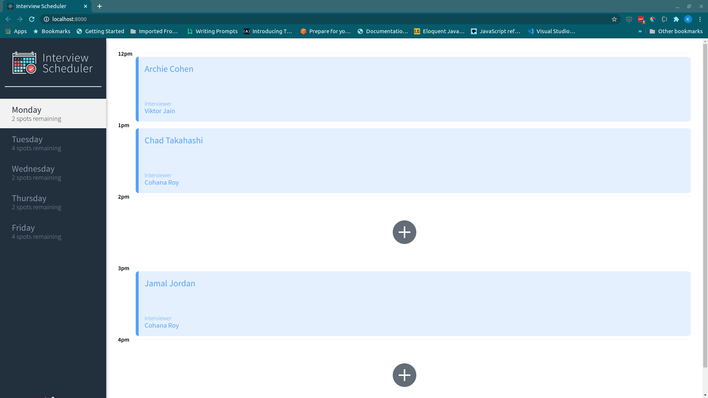
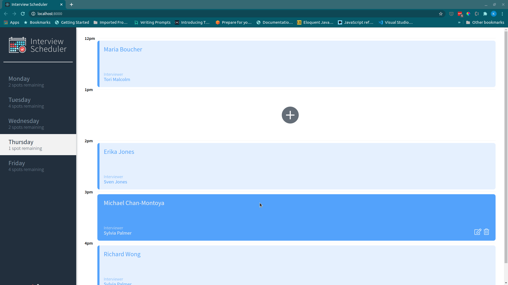
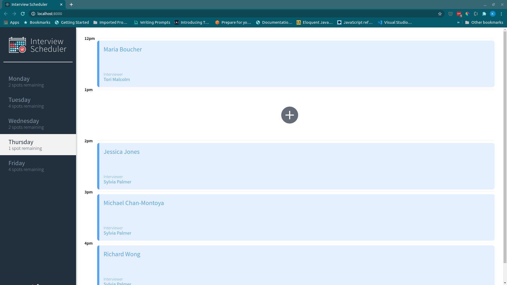

# Interview Scheduler

**Find a live version of the app here: https://zealous-sinoussi-2e244a.netlify.app/**

## Description
A React scheduler app where users can book, edit, and cancel interviews.

## Stack
```
React (Create React App)
Axios
Express
PostgresSQL

Testing:
  Storybook
  Webpack Dev Server
  Jest
  React Testing Library
```

## App Features

Users can pick their preferred day and time of appointment. If they change their mind, they can back out and choose a different time. When they find the correct slot, they can enter their name, choose an interviewer, and save the appointment.<br>
The number of appointments available for each day are adjusted in the side bar as appointments are created or deleted.
<br>
<br>


<br>
<br>

If they chose the wrong interviewer or entered their name incorrectly, they can edit the interview.
<br>
<br>


<br>
<br>

If they later decide they no longer need the appointment, they can delete it.
<br>
<br>

<br>
<br>

## Getting Started

1. Clone the [Scheduler API](https://github.com/kelsi2/scheduler-api) and follow the instructions in the README to populate the app with data.
2. Clone this repository (scheduler).
3. Run NPM install to ensure you have all of the necessary dependencies.
4. Run npm start on both your API server and local server to run the app.

## Dependencies
```
    "axios": "^0.20.0"
    "classnames": "^2.2.6"
    "normalize.css": "^8.0.1"
    "react": "^16.9.0"
    "react-dom": "^16.9.0"
    "react-scripts": "^3.4.3"
```

## Dev-Dependencies
```
    "@babel/core": "^7.4.3"
    "@storybook/addon-actions": "^5.0.10"
    "@storybook/addon-backgrounds": "^5.0.10"
    "@storybook/addon-links": "^5.0.10"
    "@storybook/addons": "^5.0.10"
    "@storybook/react": "^5.0.10"
    "@testing-library/jest-dom": "^4.0.0"
    "@testing-library/react": "^8.0.7"
    "@testing-library/react-hooks": "^3.4.2"
    "node-sass": "^4.14.1"
    "prop-types": "^15.7.2"
    "react-test-renderer": "^16.9.0"
```